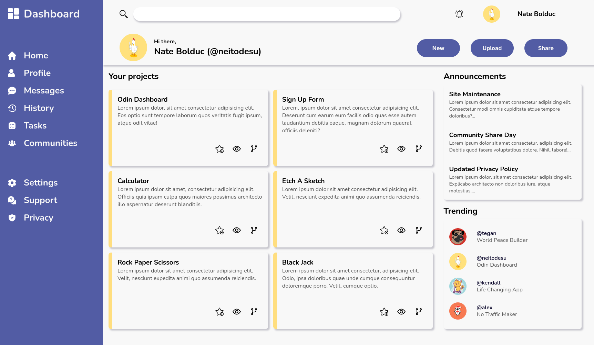

# Odin Dashboard V2

Grids on grids on grids... 

## [Live Link](https://neitodesu.github.io/odin-dashboard/) 

Nuked V1 because it was honestly just trash  
This project taught me a lot about CSS grid and I now have a way more solid understanding of how grid works vs flexbox  
There is no reactivity or mobile design as per project guidelines  
All links in projects section will take you to all the projects I've made so far with Odin

